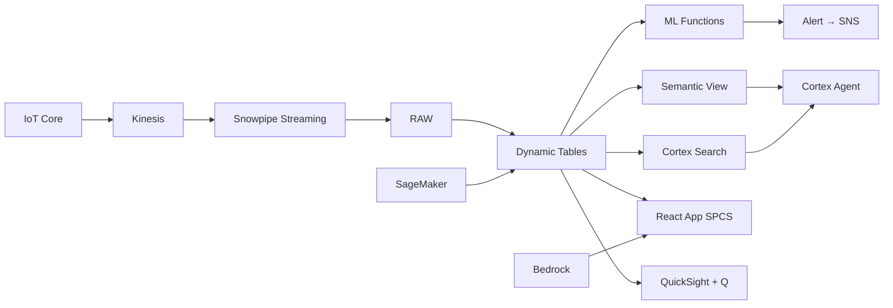

# EV Battery Production Analytics

Real-time monitoring of EV battery cell production across 6 Thai gigafactories — Snowflake ML detects quality excursions, forecasts cell degradation, and alerts production engineers before defective packs reach assembly.

## Architecture

Thailand's Eastern Economic Corridor hosts 6 EV battery gigafactories producing cells for BYD, Great Wall Motor, and MG. A 3.8% yield degradation across 3 production lines is generating ฿850M in annual scrap — the root cause spans electrode coating variance, electrolyte fill accuracy, and cathode material purity that traditional QC catches too late.



## Snowflake Capabilities

| Capability | Implementation |
|-----------|---------------|
| Dynamic Tables | LINE_YIELD_SUMMARY / YIELD_TIMESERIES / CELL_HEALTH_SCORES / MATERIAL_QUALITY_TRENDS |
| ML Functions | ML.FORECAST + ML.ANOMALY_DETECTION |
| Cortex AI | COMPLETE, AI_CLASSIFY, SUMMARIZE |
| Cortex Search | 120 documents indexed |
| Cortex Agent | BATTERY_INTELLIGENCE_AGENT |
| Semantic View | BATTERY_PRODUCTION_ANALYTICS |
| React App (SPCS) | 5 tabs + DemoGuide |


## AWS Services

| Service | Role in Demo |
|---------|-------------|
| AWS IoT Core | Ingest battery cell production telemetry (600K readings) |
| Amazon Kinesis | Stream formation cycling data to Snowpipe Streaming |
| Amazon SageMaker | Battery cell degradation prediction model |
| Amazon Bedrock (Claude) | Generate root-cause analysis reports for quality excursions |
| Amazon SNS | Alert target for thermal runaway and yield notifications |
| Amazon QuickSight + Q | Executive battery production dashboard with NL queries |


## Personas

| Persona | Role | Key Questions |
|---------|------|---------------|
| **Somchai Wongsurawat** | VP Battery Manufacturing | "Which production lines are below yield target?" "What's our total scrap cost in baht this quarter?" |
| **Kanokwan Lertpanichkul** | Battery Process Engineer | "What's causing the capacity fade in Line-03 cells?" "Show me the impedance distribution for today's batch." |


## Data

| Table | Rows | Description |
|-------|------|-------------|
| GIGAFACTORIES | 6 | EV battery manufacturing plants (Rayong, Chonburi, Chachoengsao) |
| PRODUCTION_LINES | 36 | Cell production lines across all plants |
| CELL_BATCHES | 8,000 | 90 days of cell batch production records with yield and test results |
| CELL_TELEMETRY | 600,000 | IoT sensor readings (temperature, pressure, humidity, coating thickness) |
| FORMATION_CYCLING | 200,000 | Cell formation and grading data (capacity, impedance, OCV) |
| QUALITY_REPORTS | 120 | Lab test reports, audit findings, customer complaints |
| SUPPLIER_MATERIALS | 500 | Raw material quality data (cathode, anode, electrolyte, separator) |
| THAI_EV_MARKET | 12 | Thailand EV industry context and policy data |


## Build Instructions

### Prerequisites
- Snowflake account with ACCOUNTADMIN access
- Cortex AI enabled (ML Functions, Search, Agent)
- Warehouse: BATTERY_WH (Medium)
- AWS CLI with access (us-west-2)

### Deployment

```bash
snowsql -f snowflake/00_setup.sql
snowsql -f snowflake/01_marketplace_install.sql
snowsql -f snowflake/02_raw_tables.sql
snowsql -f snowflake/03_staging.sql
snowsql -f snowflake/04_dynamic_tables.sql
snowsql -f snowflake/05_search.sql
snowsql -f snowflake/06_ml_models.sql
snowsql -f snowflake/07_semantic_view.sql
snowsql -f snowflake/08_agent.sql
```

### React App (SPCS)
```bash
cd app && npm ci && npm run build
docker build -t aws-thailand-automotive-ev-battery-app .
docker push bdiqc8sm-default.registry.snowflakecomputing.com/ev_battery_prod/app/aws_thailand_automotive_ev_battery/app:latest
```

### Demo Mode
Open the app URL with `?demo=true` for presenter view.

## Build Modes

### Snowflake Only
Run scripts 00-08 (skip AWS-specific integration). Uses:
- **Snowpipe Streaming SDK** instead of AWS IoT Core
- **Snowpipe Streaming SDK (direct)** instead of Amazon Kinesis
- **ML.ANOMALY_DETECTION + ML.FORECAST** instead of Amazon SageMaker
- **Cortex Complete** instead of Amazon Bedrock (Claude)
- **Alerts + Notification Integration** instead of Amazon SNS
- **Snowflake Intelligence (Cortex Analyst)** instead of Amazon QuickSight + Q

### Full AWS + Snowflake
Run all scripts including AWS integration. Deploy QuickSight dashboard from `quicksight/`.

## Business Impact

Industry research and Snowflake customer outcomes:
- **Thailand targets 725,000 EV production by 2030, investing ฿500B in EEC battery plants** — [BOI Thailand](https://www.boi.go.th/en/index/)
- **AI-powered battery quality monitoring reduces scrap rates by 15-25% in cell manufacturing** — [McKinsey Battery 2030](https://www.mckinsey.com/industries/automotive-and-assembly/our-insights)
- **Predictive quality in battery production prevents $2-5M per recall event** — [Deloitte EV Manufacturing](https://www2.deloitte.com/us/en/insights/industry/automotive.html)
- **BYD Thailand factory in Rayong produces 150,000 EVs annually since 2024** — [Bangkok Post](https://www.bangkokpost.com/business/general)
- **BMW Group** (Snowflake customer): saved 25% on large data workloads and launched 60 operational use cases in 18 months on Snowflake -- [snowflake.com/customers/bmw-group](https://www.snowflake.com/en/customers/all-customers/case-study/bmw-group/)

## Key Demo Numbers

- **฿850M** annual scrap cost across 6 gigafactories (US$24M)
- **3 of 36 lines** below 90% yield target (CRITICAL status)
- **12 thermal events** flagged in the last 72 hours
- **9 of 14 days** anomalous for Line-03 (ML.ANOMALY_DETECTION)
- **600K readings** ingested daily via IoT Core → Snowpipe Streaming
- **5-day forecast** yield collapse predicted without intervention (ML.FORECAST)


## License

Apache 2.0 — See [LICENSE](LICENSE) for details.

This is a personal demo project and is not an official Snowflake offering. It comes with no support or warranty.